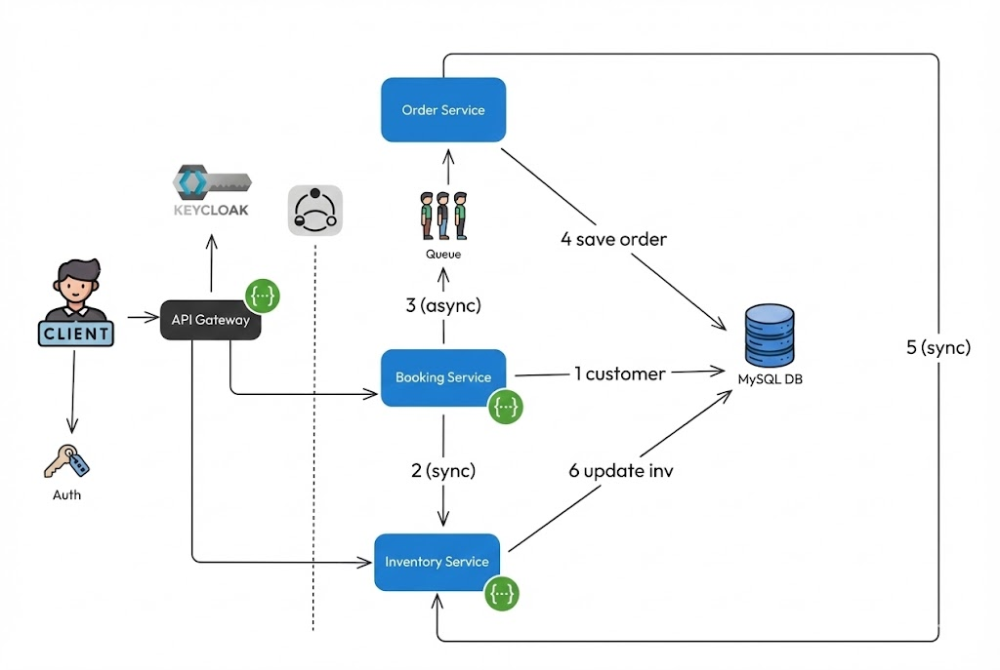
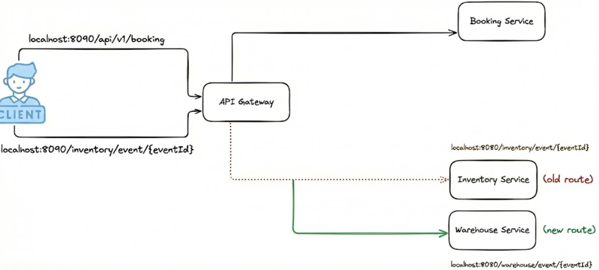

# Backend Ticket Booking Microservices

A project that shows how to build multiple small services that work together. It covers real-world topics like routing requests, services talking to each other, event-based messaging with Kafka, managing database changes, securing APIs with Keycloak, and making services reliable.

## Why This Project ?

* How Spring Boot services work together in a microservices setup
* When to use Kafka for messages vs REST calls for direct requests
* How to secure APIs using an external identity system (Keycloak)


## Key Ideas Implemented

* **Microservices Patterns:** Shows how to route requests through a gateway, keep services independent, and have each service manage its own database.
* **Event-based Communication:** Uses Kafka to let services send messages to each other asynchronously, so they can work independently and scale better.
* **API Security:** Uses Keycloak to handle user authentication and token validation across services.

## How Everything Works Together



1.  **Clients** call the **API Gateway**, which routes requests to the right service and shows you the API documentation.

2.  **Booking Service** takes booking requests and sends messages to Kafka.
3.  **Order Service** listens for those messages, saves order information, and asks **Inventory Service** to reduce available tickets.
4.  **Inventory Service** stores event and venue data, provides endpoints to read and update information, and manages database changes through Flyway.


## Services and What They Do

| Service | What it does | Example Feature |
| :--- | :--- | :--- |
| **apigateway** | Entry point for all requests. Routes them to the right service, checks security tokens, and shows combined API docs. | Controls who can access which services and forwards requests to the right place. |
| **inventoryservice** | Keeps track of events and venues. The main source of truth for this information. | Manages how many tickets are available and updates event information safely. |
| **bookingservice** | Receives booking requests from users and sends messages about those bookings. | Takes a booking request and tells other services what happened via Kafka. |
| **orderservice** | Listens for booking messages and creates order records. Also talks to inventory service. | Saves booking information permanently and makes sure tickets are updated. |


## Technology Choices and Why

* **Spring Boot (Spring Web, Data JPA):** Makes it easy to build REST services and connect to databases with less boilerplate code.
* **Kafka (spring-kafka):** Used for sending messages between services asynchronously, letting them work independently.
* **Keycloak:** A ready-made system for handling user login and access tokens, so you don't have to build security from scratch.
* **Spring Cloud Gateway (MVC):** Sits in front of all services to route requests, handle security checks, and protect services from overload.


### Example: Making a Booking

**Send this JSON:**

```json
{
  "eventId": "event-123",
  "userId": "user-456",
  "quantity": 2
}
```

**What happens behind the scenes:**

1.  **Booking Service** accepts the request and checks it's valid.
2.  Creates a message and sends it to Kafka.
3.  **Order Service** receives that message and saves the order.
4.  **Order Service** calls **Inventory Service** to reduce the ticket count.


## Running Locally (Suggested Workflow)

### Before You Start
* Java 21 (or a similar JDK version)
* Maven (or use the included `mvnw`)
* Docker & Docker Compose

### Steps

1.  **Enable Lombok** in your IDE (this tool reduces boilerplate code).
2.  **Start the Infrastructure:**
    
    ```powershell
    docker-compose up -d
    ```
    *(This starts MySQL, Kafka, and Keycloak)*

3.  **Start Each Service:**
    Run the main method in each service (Gateway, Booking, Inventory, Order) in separate terminal windows or IDE tabs.
