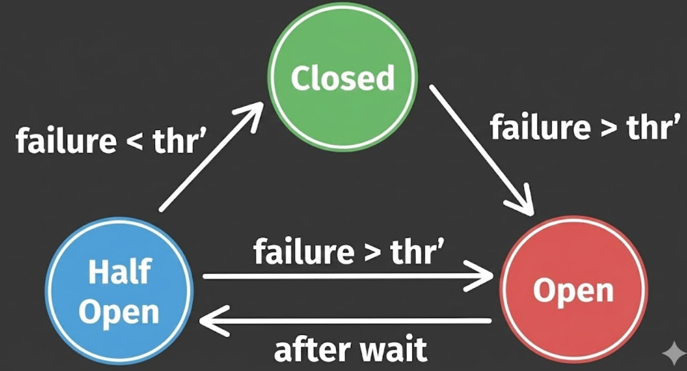

# Backend Ticket Booking Microservices

A learning-focused ticket booking example that demonstrates building a small microservices ecosystem with realistic concerns: API gateway routing, service-to-service communication, event-driven integration with Kafka, database migrations, security with an identity provider, and resilience patterns.

## Why this project / Learning Goals
* How small Spring Boot services interact in a microservices setup.
* How to integrate asynchronous messaging (Kafka) and synchronous REST calls.
* How to manage schema changes reliably with Flyway.
* How to secure APIs using an external identity provider (Keycloak).
* How to add resiliency (circuit breakers, timeouts) and developer ergonomics (OpenAPI / Swagger).


## What i learnt / Key Concepts Demonstrated

* **Microservices Patterns:** Shows request routing (API Gateway), decoupled services (Booking → Order → Inventory), and domain separation (each service owns its data and API).
* **Event-driven integration:** Demonstrates producing and consuming domain events (`BookingEvent`) via Kafka so services can react asynchronously and scale independently.
* **Data management:** Uses Flyway migrations to keep schema changes versioned and reproducible which is a pattern used in production systems to avoid ad-hoc SQL scripts.
* **Security:** Uses Keycloak as an external OAuth2/OpenID provider to illustrate how services validate JWTs and how gateways centralize access control.
* **Resilience & Observability:** Shows Resilience4j circuit breakers and Spring Actuator to make services robust and observable under partial failure.
* **Developer UX:** Uses SpringDoc/OpenAPI so each service exposes interactive API docs, and the gateway aggregates doc links for easier exploration.


## Architecture (Conceptual)


1.  **Clients** call the **API Gateway** which routes requests to the appropriate backend service and exposes consolidated API docs.

2.  **Booking service** receives booking requests and publishes `BookingEvent` messages to Kafka.
3.  **Order service** consumes `BookingEvents`, persists order records, and calls **Inventory service** to decrement available tickets.
4.  **Inventory service** owns the event and venue data, exposes read and update endpoints, and manages schema via Flyway.


## Services & Purpose

| Service | Description | Use-Case Demonstrated |
| :--- | :--- | :--- |
| **apigateway** | Central entrypoint. Handles routing, API docs aggregation, JWT validation, and resilience policies. | Centralized access control and conditional forwarding (path rewrites). |
| **inventoryservice** | Source of truth for venues and events. | Data ownership, schema migrations (Flyway), and synchronous REST APIs. |
| **bookingservice** | Accepts bookings and publishes events to Kafka. | How edge services translate user action into domain events for downstream processing. |
| **orderservice** | Kafka consumer that materializes events into persistent orders and interacts with inventory. | Eventual consistency and coordinated updates using both async and sync calls. |


## Key Technical Choices

* **Spring Boot (Spring Web, Data JPA):** Fast way to create production-grade REST services and database integration with minimal boilerplate.
* **Kafka (spring-kafka):** Chosen to show event-driven, decoupled communication patterns and to simulate realistic asynchronous workflows.
* **Flyway:** Chosen for simple, file-based, ordered DB migrations which are easy to reason about and integrate with CI/CD.
* **Keycloak:** Provides an off-the-shelf identity provider to model real security flows (token issuance, JWK verification) without building auth from scratch.
* **Spring Cloud Gateway (MVC):** Demonstrates centralized routing, path rewriting, and applying global resilience/security concerns.
* **Resilience4j:** Lightweight circuit breaker/timeout/retry primitives to show defensive programming when services fail or are slow.

* **SpringDoc / OpenAPI:** Makes it easy to inspect APIs and try requests in a browser.


## Important Files

* `docker-compose.yml` — Brings up MySQL, Kafka, Keycloak, and tooling used by the examples.
* `migration` — Flyway migrations (schema and initial data).
* `apigateway/src/main/java/.../route` — Gateway route definitions and docs rewrite logic.
* `BookingRequest.java` — Booking payload shape.
* `BookingEvent.java` — Event shape sent to Kafka.


## Ports & Infrastructure

| Component | Port (Host) | Internal/Notes |
| :--- | :--- | :--- |
| **API Gateway** | `8090` | Main Entrypoint |
| **Inventory Service** | `8080` | Direct Access |
| **Booking Service** | `8081` | Direct Access |
| **Order Service** | `8082` | Direct Access |
| **Kafka UI** | `8084` | Visualizing Topics |
| **Keycloak** | `8091` | Identity Provider |
| **MySQL** | `3307` | Maps to container `3306` |
| **Kafka Broker** | `9092` | Internal `29092` |

---

## Core HTTP Endpoints (For Quick Exploration)

* **Gateway Swagger UI:** [http://localhost:8090/swagger-ui.html](http://localhost:8090/swagger-ui.html)
* **Booking (via gateway):** `POST http://localhost:8090/api/v1/booking`
* **Inventory (direct to service):**
    * `GET http://localhost:8080/api/v1/inventory/events`
    * `GET http://localhost:8080/api/v1/inventory/venue/{venueId}`
    * `GET http://localhost:8080/api/v1/inventory/event/{eventId}`
    * `PUT http://localhost:8080/api/v1/inventory/event/{eventId}/capacity/{capacity}`

### Example Booking Request

**Request JSON:**

```json
{
  "eventId": "event-123",
  "userId": "user-456",
  "quantity": 2
}
```

### What happens:

1.  **Booking service** validates/accepts the request.
2.  Builds a `BookingEvent` and publishes it to Kafka.
3.  **OrderService** consumes it, writes an Order record.
4.  **OrderService** calls **Inventory service** to decrement capacity.


## Running Locally (Recommended Dev Flow)

### Prerequisites
* Java 21 (or compatible JDK)
* Maven (or use included `mvnw`)
* Docker & Docker Compose

### Steps

1.  **Enable Lombok** annotation processing in your IDE.
2.  **Start Infrastructure:**
    
    ```powershell
    docker-compose up -d
    ```
    *(This brings up MySQL, Kafka, and Keycloak)*

3.  **Start Services:**
    Run the `main` method in each Spring Boot application (Gateway, Booking, Inventory, Order) in separate terminals or IDE tabs.


## Common Pitfalls & Notes

* **DB Connectivity:** Services expect MySQL at `localhost:3307` (mapped by the compose file). If you run DB elsewhere, update `spring.datasource.url` in each service's `application.properties`.
* **Hostname vs Localhost:** If you dockerize the services themselves (instead of running on the host), use container hostnames (compose service names) rather than `localhost`.
* **Keycloak Availability:** Gateway fetches JWKs from Keycloak. If Keycloak is not running or the realm is not imported, token validation will fail.
* **Swagger through Gateway:** The gateway rewrites paths for each service's OpenAPI docs — you can open aggregated docs at the gateway UI.